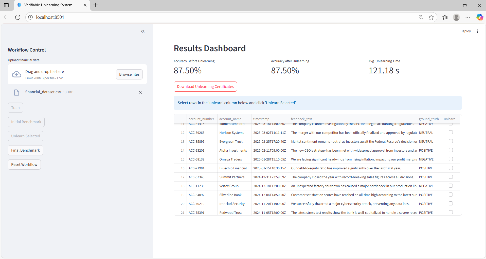

# 🛡️ ForgetMeNet

A modern, efficient, and verifiable system to "forget" user data from machine learning models, with immutable proof logged to the InterPlanetary File System (IPFS).

---

## 📜 The Problem: The Right to be Forgotten

In the age of data privacy regulations like GDPR and CCPA, individuals have the "right to be forgotten." This means companies must be able to delete a user's data from their systems upon request. For standard databases, this is a simple DELETE command.

But what about machine learning models?

A model trained on user data retains information about that data in its parameters (weights and biases). Simply deleting the original data point from the training set isn't enough; the model's "memory" of that data persists. The only traditional solution is to retrain the entire model from scratch on the modified dataset, a process that is:

- **Extremely Expensive**: Retraining large models can cost thousands of dollars in compute time.
- **Slow**: It can take days or even weeks, making it impractical for handling frequent user requests.
- **Unverifiable**: How can a user be sure their data has truly been "unlearned"?

This project tackles these challenges head-on.

---

## ✨ Our Solution: Efficient, Verifiable Unlearning

This system provides a practical framework for machine unlearning by combining three key technologies:

- **SISA (Sharded, Isolated, Sliced, and Aggregated) Training**: Instead of one massive, monolithic model, we train multiple small, independent models (shards). When a request to unlearn a data point arrives, we only need to discard and retrain the single, tiny shard that contained that data.
- **Sentiment-Driven Unlearning Trigger**: The system automatically analyzes the sentiment of feedback text. If the sentiment is Negative or Neutral, it's flagged for unlearning.
- **IPFS for Certification**: After a shard is retrained, the system generates a Certificate of Unlearning and uploads it to IPFS for decentralized, immutable, and publicly verifiable storage.

---

## 🧠 How SISA Works: The Encyclopedia Analogy

SISA works like a set of encyclopedias:

- **Sharding/Slicing**: Dataset is split into many small "shards."
- **Isolation**: A separate, small ML model is trained on each data shard.
- **Unlearning**: Identify the shard, discard and retrain just that shard's model.


---

## 💻 Technology Stack

| Component   | Technology                                                 | Purpose                                                |
|------------|------------------------------------------------------------|--------------------------------------------------------|
| Frontend   | Streamlit                                                  | Interactive web UI for file upload and real-time logs |
| Backend    | FastAPI                                                    | High-performance asynchronous API                      |
| Sentiment AI | Hugging Face Transformers (`distilbert-base-uncased-finetuned-sst-2-english`) | Sentiment analysis                                    |
| Unlearning | Scikit-learn                                               | SISA training and retraining logic                     |
| Certification | IPFS (via IPFS Desktop)                                 | Decentralized storage for unlearning certificates      |

---

## ⚙️ System Architecture


---

## 🚀 Setup and Usage

### Prerequisites

- Python 3.8+
- IPFS Desktop installed and running
- A virtual environment (recommended)

### 1. Clone the Repository

```bash
git clone https://github.com/OnePunchMonk/IPFS-for-Unlearning
cd IPFS-for-Unlearning
```

### 2. Create and Activate Virtual Environment

```bash
python -m venv venv
# Windows PowerShell
.env\Scripts\Activate.ps1
# macOS/Linux
# source venv/bin/activate
```

### 3. Install Dependencies

```bash
pip install -r requirements.txt
```

### 4. Run the Backend

```bash
cd backend
uvicorn api:app --reload
```

### 5. Run the Frontend

```bash
cd frontend
streamlit run app.py
```


---
## 🧰 Command-Line Interface (CLI)

The project includes a simple yet powerful CLI tool to interact with the backend API directly from your terminal.

### 🔧 Usage

Make sure the FastAPI server is running locally (`http://127.0.0.1:8000`) before using the CLI.

Run the CLI commands using:

```bash
python cli.py [COMMAND] [OPTIONS]
```

### 📋 Available Commands

| Command         | Description                                               |
|-----------------|-----------------------------------------------------------|
| `status`        | Checks if the API and its services are up and responsive. |
| `process`       | Sends a record for unlearning and triggers certification. |

### 🧪 Example

```bash
python cli.py process \
  --record-id "CLI-001" \
  --text "This service is slow and unresponsive." \
  --full-record-json '{"account_number": "CLI-001", "account_name": "CLITest"}'
```

This sends the record to the unlearning system, and upon successful processing, a certificate is generated and logged to IPFS.
---

## 🔮 Future Improvements

- **Enhanced Security**: Encrypt data before sending to IPFS.
- **Scalability**: Parallelize SISA retraining logic.
- **Advanced UI**: View certification logs directly from IPFS.
- **Model Support**: Extend to more complex deep learning models.

---

## ✅ Conclusion

This project offers a realistic and scalable solution to user data unlearning. Through SISA and IPFS, it ensures that forgetting data is efficient, verifiable, and privacy-respecting.


### 🧩 Additional Future Extensions

- **Apache Kafka**: Integrate Kafka for real-time streaming and decoupled communication between the frontend and backend services. This would allow the system to scale better and handle large volumes of concurrent user interactions.

- **Apache Airflow**: Use Airflow for orchestration of unlearning workflows. This would make it easier to schedule retraining jobs, monitor execution, and retry on failure, increasing robustness.
